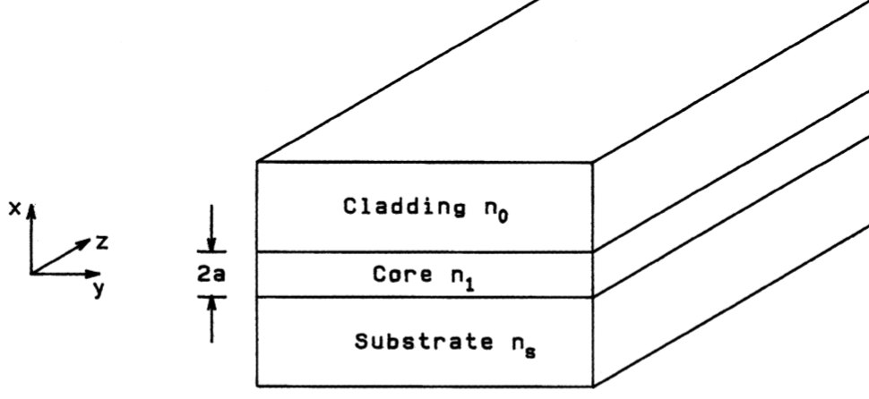
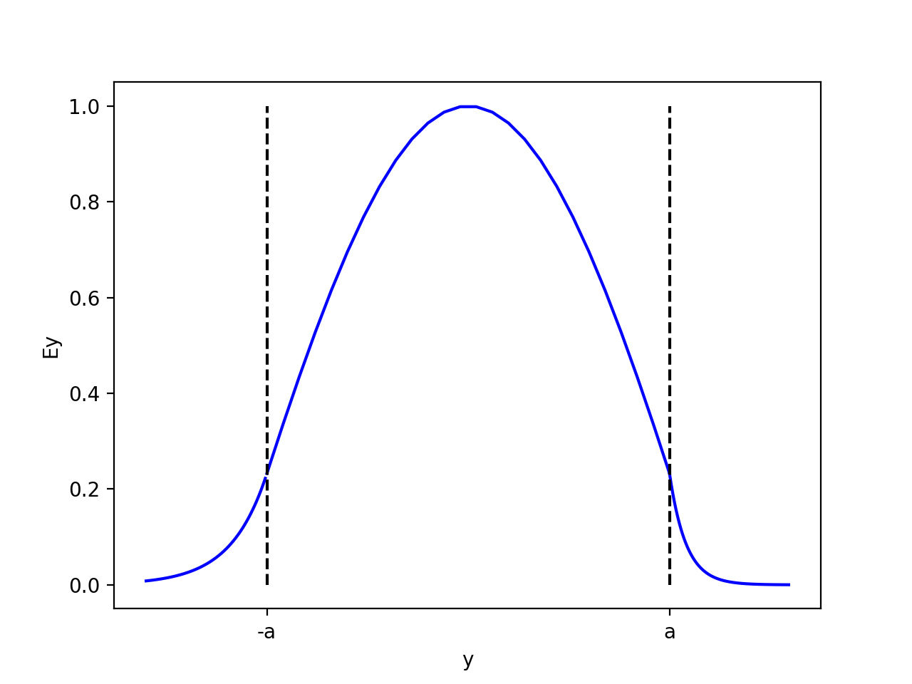
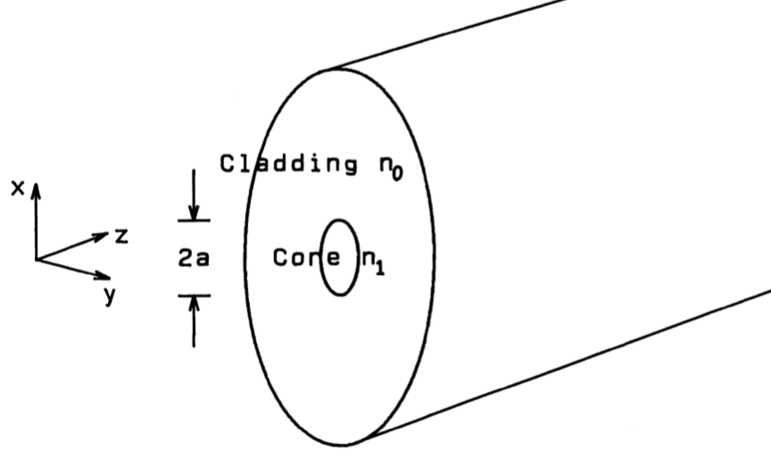
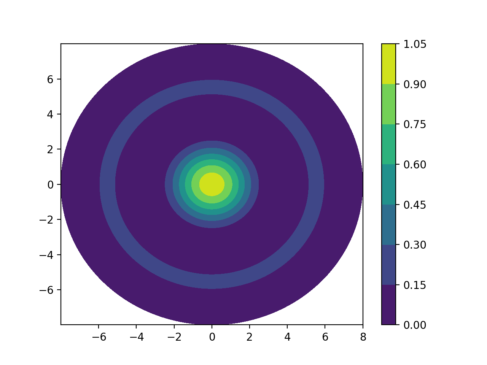
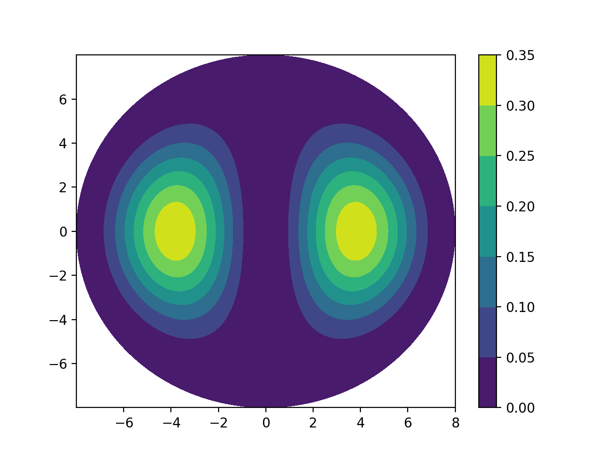
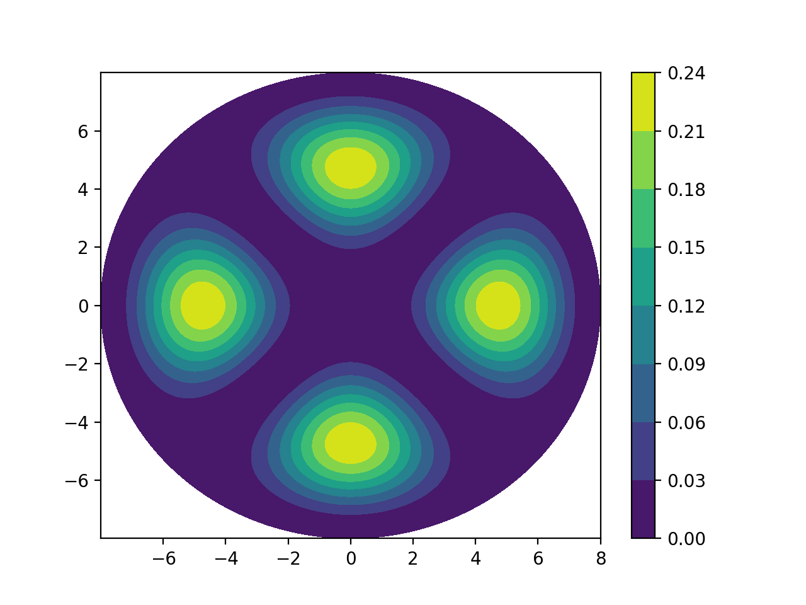
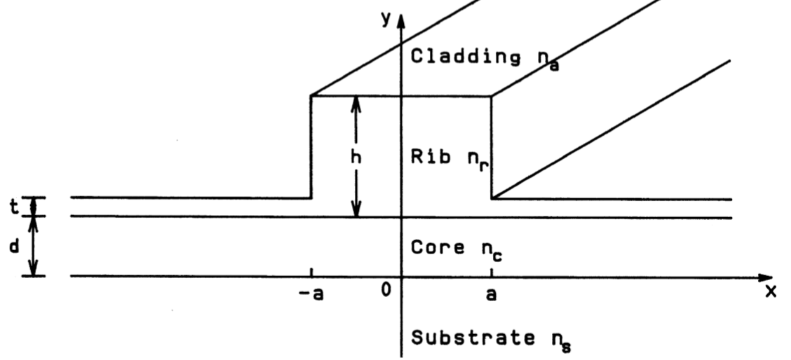
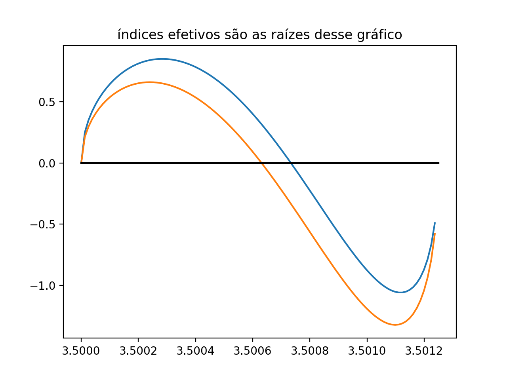
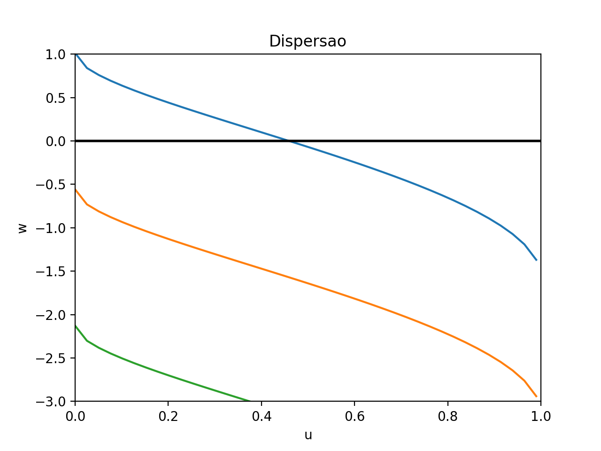
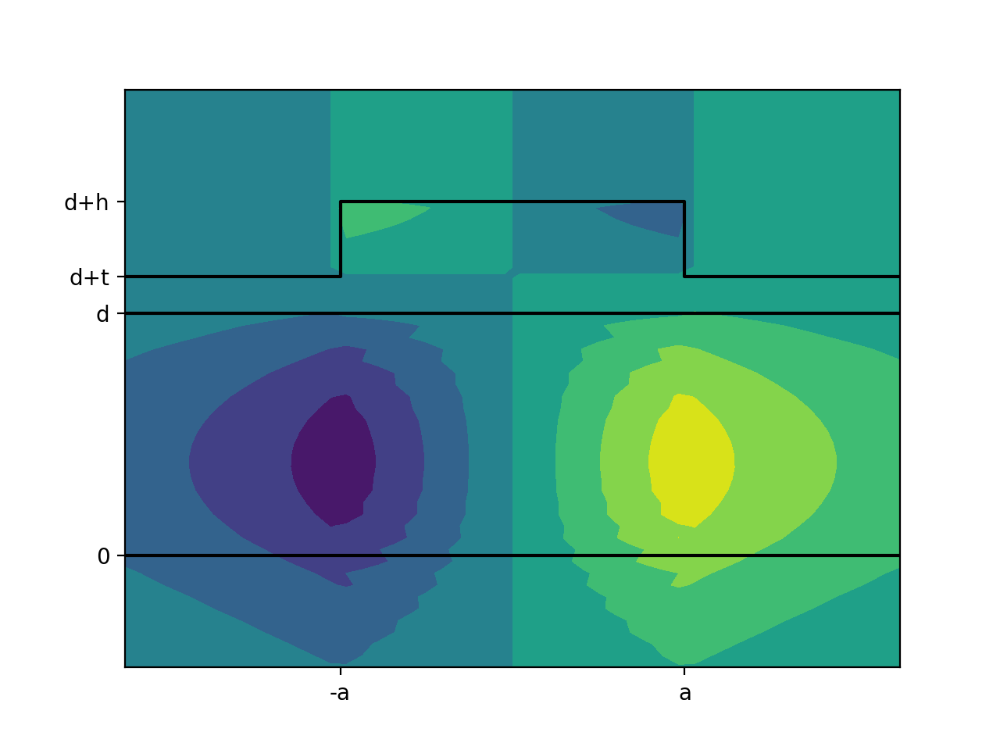

# Guias de onda

## Descrição geral

Guias de onda são estruturas guiantes (quem diria), longitudinais, utilizadas para o transporte de informação e energia. Basicamente, guias de onda controlam a trajetória
da onda, para que ela vá até os pontos que queremos.

Existem diversos tipos de guias, cada uma utilizada para uma faixa de frequência, aplicação e tipo de polarização da onda eletromagnética. Aqui apresento alguns códigos que calculam as principais propriedades de algumas guias. Propriedades como índice efetivo, constante de propagação e curva de dispersão.

## guia_planar

Este código calcula os modos de propagação para uma guia de onda planar. Como input, você fornece o valor dos índices de refração de cada camada e o comprimento 2*a, que é a espessura do núcleo.

Guias de onda planares são estruturas de três camadas, como mostra a figura abaixo. Um sanduiche, em que o material das pontas, o revestimento (_cladding_) e o substrato (_substrate_), além da parte central é conhecida como núcleo (_core_).

  

A onda fica confinada no núcleo, que têm índice de refração maior que o revestimento.

O código se separa em 2 partes.

 - **Cálculo do índice de refração efetivo (neff)**: neff é a razão da constante de fase (β) com o comprimento de onda da propagação (λ). Este valor é calculado usando o método da bisseção para calcular neff através equação de dispersão;
 
 - **Plot da dispersão de campo**: com o índice em mãos, basta aplicá-lo nas equações de distribuição de campo. Como resultado, temos o gráfico do campo ao longo do eixo Y, como mostra a figura abaixo.
 
   
 
## fibra_optica

Outro tipo bem interessante de guias de onda são as fibras ópticas. Fibras ópticas são o meio de transmissão mais importante para sistemas de comunicação óptica de longa distância e grande capacidade. A característica mais distinta da fibra óptica são suas características de baixa perda (internet de fibra é o que há!).

Como inputs, apenas os índices de refração do núcleo e do revestimento, o comprimento de onda e o raio do núcleo.

O código se separa em 2 partes.

 - **Cálculo do modo de propagação**: bem semelhante a calcular o índice de refração efetivo, pois o modo é a raiz de uma equação diferencial, porém a equação diferencial é uma função de bessel e aqui não apliquei o método da bisseção;
 
 - **Plot da dispersão de campo**: com o índice em mãos, basta aplicá-lo nas equações de distribuição de campo. Como resultado, temos os gráficos da dispersão espacial do campo, como mostram as figuras abaixo, para os modos m0, m1 e m2.
 
 
 
 
 

## Guia Retangular

Este é um tipo mais geral de guia de onda planar. A diferença estrutural, é que agora temos um quarto componente, o rib. Ele apresenta duas alturas, para -a<x<a,o rib tem altura h, para o resto da guia, a altura é t. A ideia é que a onda se confine nessa faixa, -x<a<x. Perceba que se h = t, temos uma guia planar, como no exemplo **guia_planar**.

 
 
 Este projeto está centrado no código **main.py** e se separa em 3 partes:
 
 - **Cálculo dos índices de refração efetivo (neff)**: A ideia da guia planar é separar a estrutura em 3 guias planares (para x<-a, -a<x<a, x>a), nesse caso temos dois neffs (já que para x<-a e x>a temos a mesma estrutura). Com isso, temos o gráfico a seguir, em que as raízes de duas curvas representam os índices de refração efetivo.
 
  
  
- **Curva de dispersão**: Ao pegar os índices, podemos plotar a curva de dispersão, a ideia aqui é vermos quantos modos guiáveis existem. Quanto a curva _u x w_ tem raíz, isso significa que o modo é guiável. No exemplo da figura abaixo, vemos que há apenas 1 modo guiável.

  
  
- **Plot da dispersão de campo**: Com tudo em mãos, plota-se a dispersão do campo no espaço. As equações de dispersão do campo estão em **xfield_func.py** e **yfield_func.py**.

  
