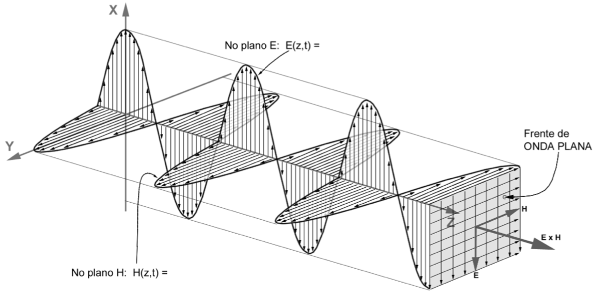
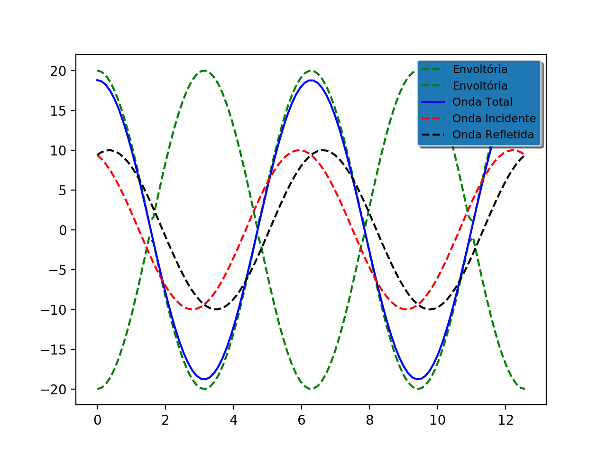

# Ondas Planas

## Descrição geral

  Ondas planas são aquelas em que o campo elétrico **E** e o magnético **H** são constantes no plano (_x,y_) perpendicular a direção de propagação (_+z_), dessa forma uma onda plana varia apenas em função de _z_ e do tempo _t_, ou seja, **E**=**E**_(z,y)_. Talvez a figura a seguir explique melhor do que a frase anterior haha.
  
  
  
  Nessa pasta há códigos relacionados a propagações de ondas planas no espaço. Estes códigos tratam apenas da propagação sem atenuação. A seguir apresento uma breve descrição do que eles calculam e como calculam.
  
## movimento_sem_atenuacao

  Neste código, investiga-se a propagação de uma onda eletromagnética sem atenuação, sem perdas.

  O código em si é bastante simples, apenas calcula a intensidade da propagação da onda ao longo de uma linha, calculando, assim, as seguintes contribuições:
  
   - **onda incidente**: Onda incidente refere-se àquela que se propaga na direção de propagação (_+z_);
   - **onda refletida**: Onda refletida é a que se propaga na direção oposta a de propagação (_-z_);
   - **onda total**: Soma das contribuições das ondas incidente e refletida;
   - **envoltória**: Curva que preenche os limites máximos da onta total. Ao fazer uma curva que tangencia todos os pontos de amplitude máxima da curva verde, temos a curva envoltória. Em propagações sem perdas, essa curva é uma reta constante.
   
   Como resultado deste código, temos o gif abaixo.
   
   
   
   
   
